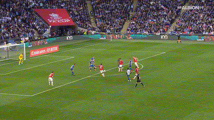
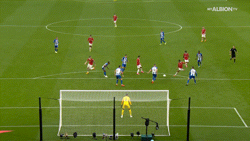
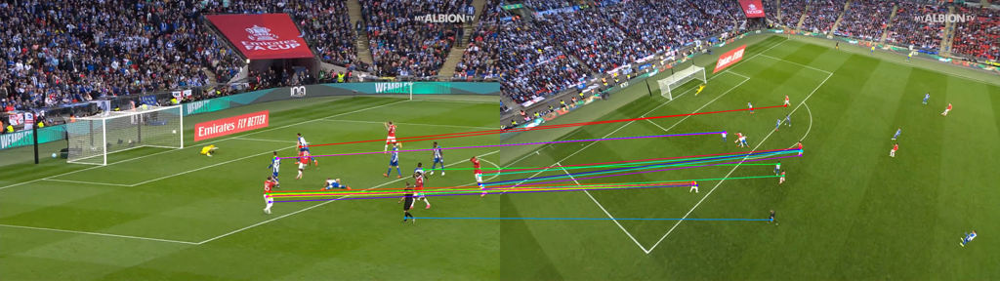
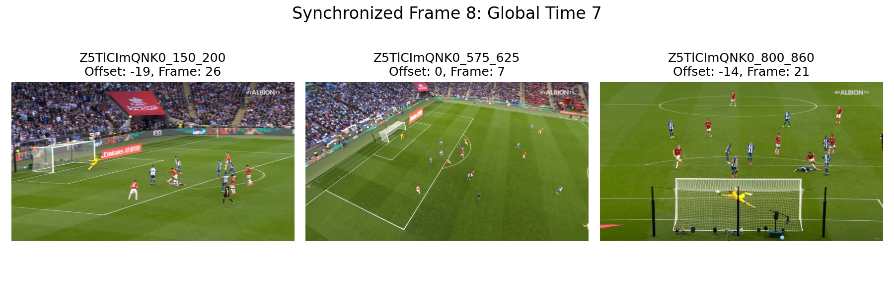
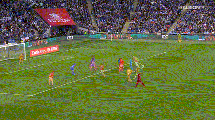
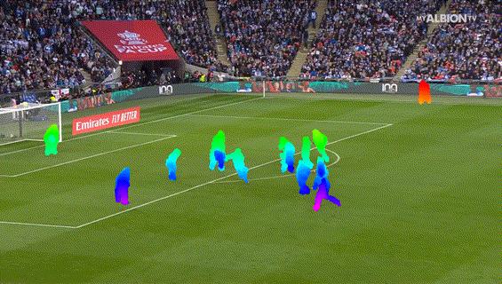

<br />
<p align="center">

  <h1 align="center">VisualSync: Multi-Camera Synchronization via Cross-View Object Motion</h1>

  <p align="center">
   NeurIPS, 2025
    <br />
    <a href="https://stevenlsw.github.io"><strong>Shaowei Liu*</strong></a>
    ·
    <a href="https://Davidyao99.github.io/"><strong>David Yifan Yao*</strong></a>
    ·
    <a href="https://saurabhg.web.illinois.edu/"><strong>Saurabh Gupta†</strong></a>
    ·
    <a href="https://shenlong.web.illinois.edu/"><strong>Shenlong Wang†</strong></a>
    ·
  </p>

<p align="center"> 

</p>

  <p align="center">
    <a href='https://drive.google.com/file/d/1-MwQRWBm_I3576gBaC_f7D3iYcFpiox0/view?usp=sharing'>
      </a>
    <a href='https://arxiv.org/abs/2512.02017'></a>
    <a href='https://stevenlsw.github.io/visualsync/' style='padding-left: 0.5rem;'>
      </a>
    <!-- <a href='' style='padding-left: 0.5rem;'></a>
    <a href='https://youtu.be/' style='padding-left: 0.5rem;'>
      </a> -->
  </p>

</p>
<br />

This repository contains the pytorch implementation for the paper [VisualSync: Multi-Camera Synchronization via Cross-View Object Motion](https://stevenlsw.github.io/visualsync/), NeurIPS 2025. **VisualSync** aligns unsynchronized multi-view videos by matching object motion with epipolar cues. The synchronized outputs can benefit dynamic reconstruction, novel view synthesis, and multi-view data engines.


## Overview


## 📄 Table of Contents

- [Installation](#installation)
- [In-the-Wild Demo](#in-the-wild-demo)
- [Data Preprocessing](#preprocessing)
- [Citation](#citation)


## Installation

- Clone this repository: 
    ```Shell
    git clone https://github.com/stevenlsw/visualsync.git
    cd visualsync
    ```

- Install Conda Environment
    > **Note:** This installation is tested to work with **CUDA 12.4**.
    ```bash
    bash scripts/install.sh # create conda env visualsync
    conda activate visualsync
    ```

- Download Model Weights
    ```bash
    bash scripts/download_weights.sh
    ```


## In-the-Wild Demo
We show how to synchronize 3 EFL views. 

| View 1 | View 2 | View 3 |
|:-------:|:-------:|:-------:|
|  |  |  |

### Step-0: Preprocess
---
 We provide the preprocessed data for the demo at [](). Please download and unzip, place it in the `data` directory. For custom videos, please follow the data [preprocessing](#preprocessing) steps below.
```Shell
  data/Z5TlCImQNK0/
    ├── Z5TlCImQNK0_150_200/
    │   ├── rgb/ # store video frames
    │   ├── deva/ # store dynamic object masks
    │   ├── vggt/ # store camera parameters
    │   ├── cotracker/ # store tracking results
    ├── Z5TlCImQNK0_575_625/
    ├── Z5TlCImQNK0_800_860/
  ```

### Step-1: Cross-view matching
---
- Visualize cross-view matching:




### Step-2: Pairwise synchronization
---
- Visualize the energy landscape, the X-axis is the offsete, Y-axis is the synchronization Sampson error.
<!--  -->
<p align="center">
  
</p>

### Step-3: Global synchronization
---
- Visualize the synchronization results at each time step from all views.

{width=50%}


## Preprocessing
Given custom videos, follow the following steps to preprocess the data and run synchronization follow [in-the-wild demo](#in-the-wild-demo).

### 1. Dataset Preparation
---

- The dataset is organized in the following structure. The main data directory (e.g., `DATA_DIR`) can be named anything, but the subdirectories must follow this format for the preprocessing scripts to work correctly:
    ```text
    DATA_DIR/
    ├── scene1_cam1/
    │   └── rgb/
    │       ├── <img_name>1.jpg
    │       ├── <img_name>2.jpg
    │       └── ...
    ├── scene1_cam2/
    │   └── rgb/
    │       └── ...
    ├── scene1_3/
    │   └── rgb/
    │       └── ...
    └── scene2_1/
        └── rgb/
            └── ...
    ```
- **Important Formatting Rules:**
    * **Scene Grouping:** The name of each video directory must have its **scene name before the first underscore** to identify scenes and views (e.g., `scene1_cam1` and `scene1_3` are grouped as `scene1`). This is critical for the VGGT and segmentation scripts.
    * **Image Directory:** All video frames (images) must be stored in a subdirectory named `rgb`.
    * **Static Cameras:** If a video directory name contains **"cam"** (e.g., `scene1_cam1`), it is treated as a static camera. For these videos, **only the first image** will be used for pose prediction, for dynamic cameras (not include `cam` in its name) all images will be used for pose estimation.


### 2. Dynamic Object Segmentation
---

There are multiple ways for video dynamic object segmentation. Here we follow [Uni4D](https://github.com/Davidyao99/uni4d/). We use GPT to recognize dynamic objects in the video and use [SAM2](https://github.com/facebookresearch/sam2) to segment dynamic objects per frame and use [DEVA](https://github.com/hkchengrex/Tracking-Anything-with-DEVA/) to track across frames. User can simply use latest [SAM2](https://github.com/facebookresearch/sam2) for dynamic object tracking and bypass below steps.

- 1. [Optional] Find your API key at [platform.openai.com/api-keys](https://platform.openai.com/api-keys) and set it as an environment variable (bypass by specifying dynamic object names in SAM2)
    ```bash
    export "OPENAI_API_KEY=sk-your_api_key_here" # (Be sure to replace `sk-your_api_key_here` with your actual key.)
    ```
    

- 2. [Optional] Call GPT to identify dynamic objects (bypass by specifying dynamic object names in SAM2)
    ```bash
    python preprocess/run_gpt.py --workdir data/python preprocess/run_gpt.py --sample 30
    ```

- 3. Run GroundingDINO SAM2 to segment dynamic objects
    ```bash
    python preprocess/run_dino_sam2.py --workdir data/Z5TlCImQNK0
    ```
- 4. [Optional] Run DEVA to track dynamic objects (bypass by running video segmentation in SAM2)
    ```bash
    cd Tracking-Anything-with-DEVA/
    python evaluation/eval_with_detections.py --workdir data/Z5TlCImQNK0 --max_missed_detection_count 9000 --output-dir deva
    cd ..
    ```
- The output segmentation visualization:

  

## 3. Camera Pose Estimation

- Run VGG-T to get camera pose estimation. Beside saving the camera parameters, it will also save the visualization as colmap format under `vggt_output` directory for visualization or debug.
    ```bash
    python preprocess/vggt_to_colmap.py --workdir data/Z5TlCImQNK0 --vis_path vggt_output --save_colmap
    ```
## 4. Pixel-level Tracking 
- Run CoTracker3 to get tracking results:

  


## Citation
```BiBTeX
@inproceedings{liu2025visualsync},
  title={VisualSync: Multi-Camera Synchronization via Cross-View Object Motion},
  author={Liu, Shaowei and Yao, David Yifan and Gupta, Saurabh and Wang, Shenlong},
  booktitle={NeurIPS},
  year={2025}
}
```


## Acknowledgement
- [Uni4D](https://github.com/Davidyao99/uni4d/) for dynamic object segmentation.
- [SAM2](https://github.com/facebookresearch/sam2) for video segmentation.
- [DEVA](https://github.com/hkchengrex/Tracking-Anything-with-DEVA/) for video segmentation.
- [CoTracker3](https://github.com/facebookresearch/co-tracker) for video tracking. 
- [VGGT](https://github.com/facebookresearch/vggt) for camera pose estimation.
- [MASt3R](https://github.com/naver/mast3r) for cross-view correspondence.